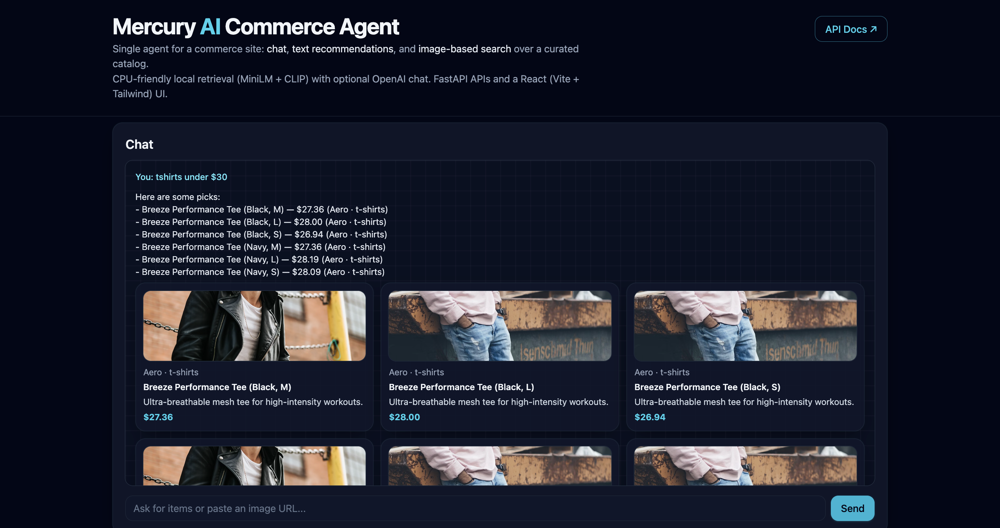
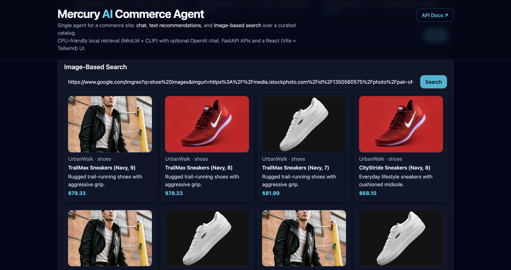
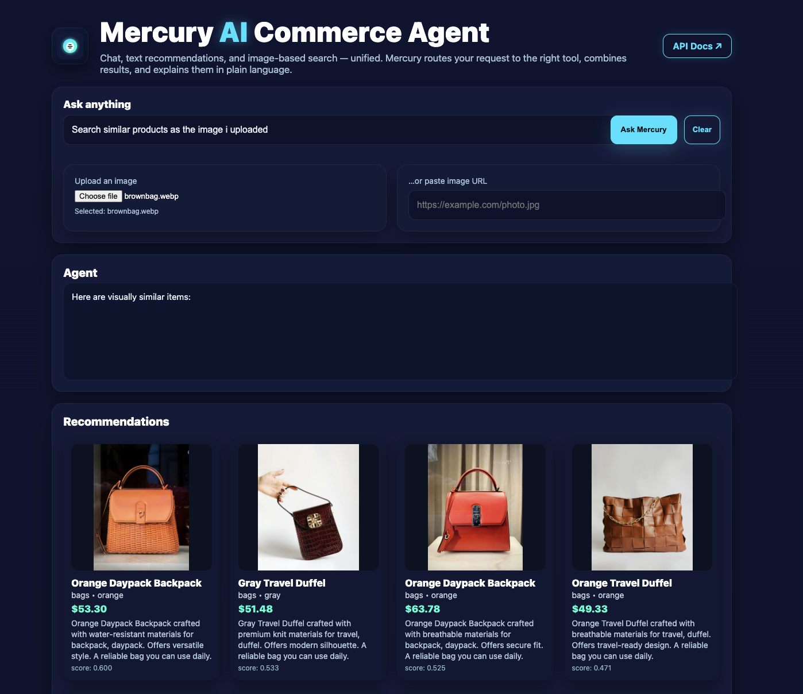
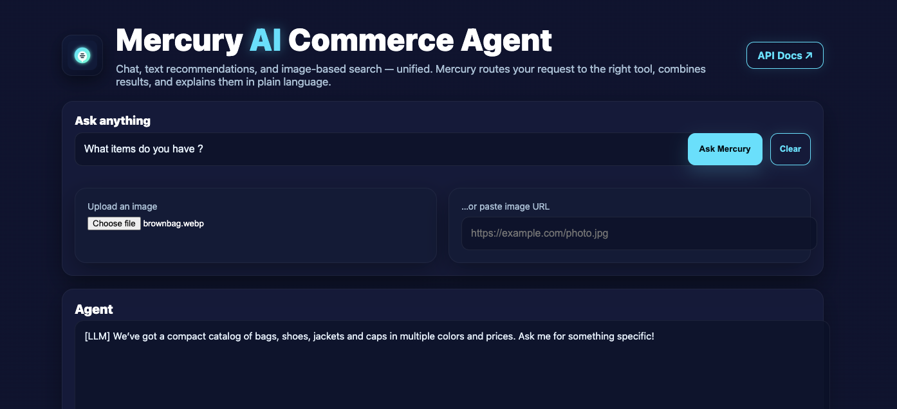
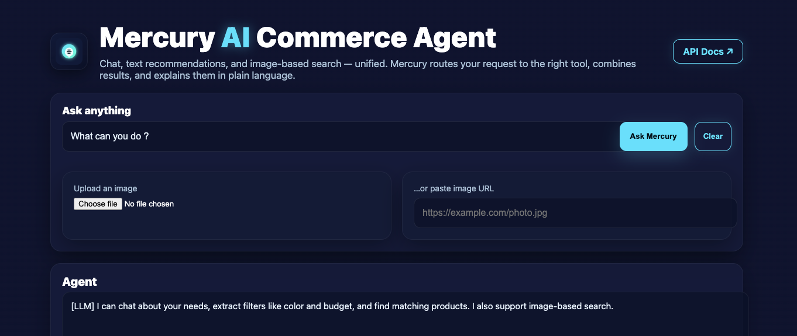

# Mercury — AI Agent for a Commerce Website

**One agent, three modes:** general chat · text recommendations · image-based product search  
Stack: **FastAPI** (backend) + **Vite React (TypeScript)** + **Tailwind**. Optional LLM (Gemini/OpenAI/Ollama).

---

## Requirements Coverage

- **User-friendly frontend** → Polished React UI (chat, upload, URL image search, recommendations, catalog).
- **Documented API** → FastAPI Swagger 
- **Single agent handles all** → One backend exposes **chat**, **text recs**, **image search** over a single catalog.
- **Optional LLM Pulgins** → Works offline; if Gemini/OpenAI Keys are set, upgrade to LLM.

---

## Quickstart

### Backend (FastAPI)

```bash
cd backend
python -m venv .venv && source .venv/bin/activate   # Windows: .venv\Scripts\activate
python -m pip install --upgrade pip
pip install -r requirements.txt
uvicorn app:app --host 0.0.0.0 --port 8000 --reload
# Docs → http://localhost:8000/docs
```

**Env (LLM Support):**
```bash
# Gemini
export GOOGLE_API_KEY=...
# OR OpenAI
export OPENAI_API_KEY=...
```

**Preferred local setup (persist key without committing):**
```bash
cd backend
cp .env.example .env
# edit backend/.env and set GOOGLE_API_KEY=...
# optional model override if your key does not have access to the default:
# GEMINI_MODEL=gemini-2.5-flash
```

### Frontend (Vite + React + Tailwind)

```bash
cd frontend
cp .env.example .env                  # ensure VITE_API_BASE=http://localhost:8000
npm install
npm run dev                           # UI → http://localhost:5173
```

### Secrets Management (Interview Ready)

- **Local dev:** keep real secrets in `backend/.env` (already gitignored).
- **Repository-safe template:** `backend/.env.example` contains only placeholder keys.
- **CI secret injection:** add `GOOGLE_API_KEY` in GitHub repo settings:
  `Settings -> Secrets and variables -> Actions -> New repository secret`
- **Smoke validation:** run workflow `LLM Smoke (Manual)` from Actions tab to verify `/api/compare_advice` returns LLM output using the GitHub secret.

---

## Agent Behavior & Endpoints

- **Chat** — `POST /api/chat`  Answers small-talk with catalog-aware context. **Intent routing** to chat/recommendations/image search.
- **Text Search/Recommendations** — `POST /api/search_text`  

- **Image Search (upload)** — `POST /api/search_image`
- **Image Search (URL)** — `POST /api/search_by_url` 
- **Catalog** — `GET /api/catalog` returns the item list used by recommenders
- **Static Images** — served at `/data/<category>/<file>` from `backend/data`.

---

## Design Notes

- **Unified agent** orchestrates small‑talk (LLM), text recs (BM25 + embeddings), and CLIP visual search.
- **Graceful degradation**: if no LLM keys, the agent still performs deterministic routing and clear responses.
- **Frontend UX**: dark neon theme, shows source tag, inline product cards.
- **Maintainability**: typed services, clear `data/` boundary, reindex & path‑repair utilities.

- **Future Extensions**: Stronger CLIP encoders, vector DB (pgvector/Qdrant), personalization and session memory, admin boosting/pinning.

---

## Repo Layout

```
ai-commerce-agent-pro/
├── backend/
│   ├── app.py
│   ├── requirements.txt
│   ├── schemas.py
│   ├── data/
│   │   ├── catalog.json
│   │   └── <category>/<images...>
│   ├── scripts/
│   └── services/
│       ├── catalog_loader.py
│       ├── text_index.py
│       ├── vision_search.py
│       └── path_repair.py
└── frontend/
    ├── .env.example
    ├── index.html
    ├── package.json
    ├── vite.config.ts
    └── src/
        ├── App.tsx
        ├── main.tsx
        ├── api.ts
        └── components/ProductCard.tsx
```

---

## Demo








## Presentation

```
Present at: assets/AI_Agent_Mercury_Presentation.pdf

```

---

## Interview Demo Script (5-7 min)

Use this sequence during your screen-share:

1. Open UI and describe the three capabilities: chat, text recommendations, image search.
2. Run a text query with constraints:
   - Example: "show me pink shoes under 90"
3. Run a chat-style query:
   - Example: "what can you do?"
4. Run image search by URL or upload.
5. Open Swagger docs and show typed API contracts and response models.
6. Mention reliability work:
   - request validation
   - standardized JSON errors
   - request latency logging
   - API tests with `FastAPI TestClient`

---

## Interview Talking Points

- **Problem**: unify chat + search + visual retrieval in one practical agent.
- **Architecture choice**: keep services modular but expose one coherent API.
- **Hard bug solved**: stale/incorrect colors from metadata drift; fixed by treating file names in `backend/data` as source truth.
- **Quality improvements**: typed schemas, explicit validation, deterministic tests, Dockerized run path.
- **Tradeoff awareness**: in-memory indexes are great for small catalogs, but vector DB is better at larger scale.

---

## Quick Commands (Interview Friendly)

```bash
# Run full stack
make up

# Stop stack
make down

# Tail logs
make logs

# Rebuild catalog + indices via API
make reindex

# Run backend API tests
make test-backend
```

---

## Additional Project Docs

- Architecture details: `ARCHITECTURE.md`
- Contribution workflow: `CONTRIBUTING.md`
- Backend tests: `backend/tests/README.md`
- Interview presentation page: `INTERVIEW_PRESENTATION.md`

---

## Known Limitations

- Catalog/index rebuild is synchronous and may be slower on larger datasets.
- Retrieval quality is tuned for a compact demo catalog, not yet benchmarked at scale.
- No persistence for user sessions/personalization yet.

---

## Roadmap

- Add retrieval evaluation metrics (precision@k, recall@k on labeled queries)
- Add vector DB backend (`pgvector` or `Qdrant`)
- Add structured observability dashboards (latency/error/search quality)
- Add personalization/session memory and explainable ranking

---

## CI and Quality Gates

- GitHub Actions workflow at `.github/workflows/ci.yml`
- Runs on push + pull request:
  - Backend tests (`pytest tests/test_api.py`)
  - Frontend production build (`npm run build`)

---

## Health and Readiness Endpoints

- `GET /healthz` basic process liveness
- `GET /readyz` dependency and index readiness checks

Quick checks:

```bash
make health
make ready
```

---

## Retrieval Evaluation (Interview Metric Demo)

Use the labeled query set in `backend/scripts/eval_queries.json` to benchmark search quality:

```bash
make eval-retrieval
```

Or run directly:

```bash
cd backend
python scripts/eval_retrieval.py --top-k 5 --json-output .cache/eval_report.json
```

Offline-safe mode (forces TF-IDF evaluation path):

```bash
cd backend
python scripts/eval_retrieval.py --top-k 5 --force-tfidf
```
