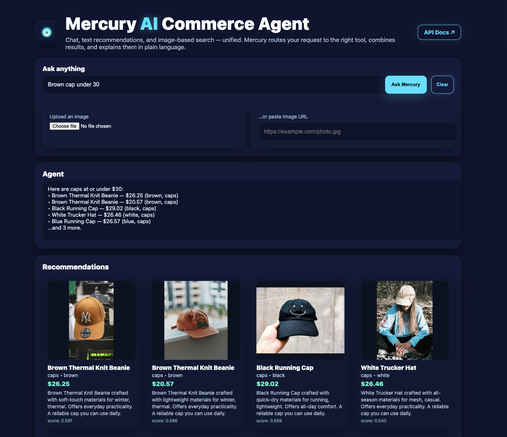
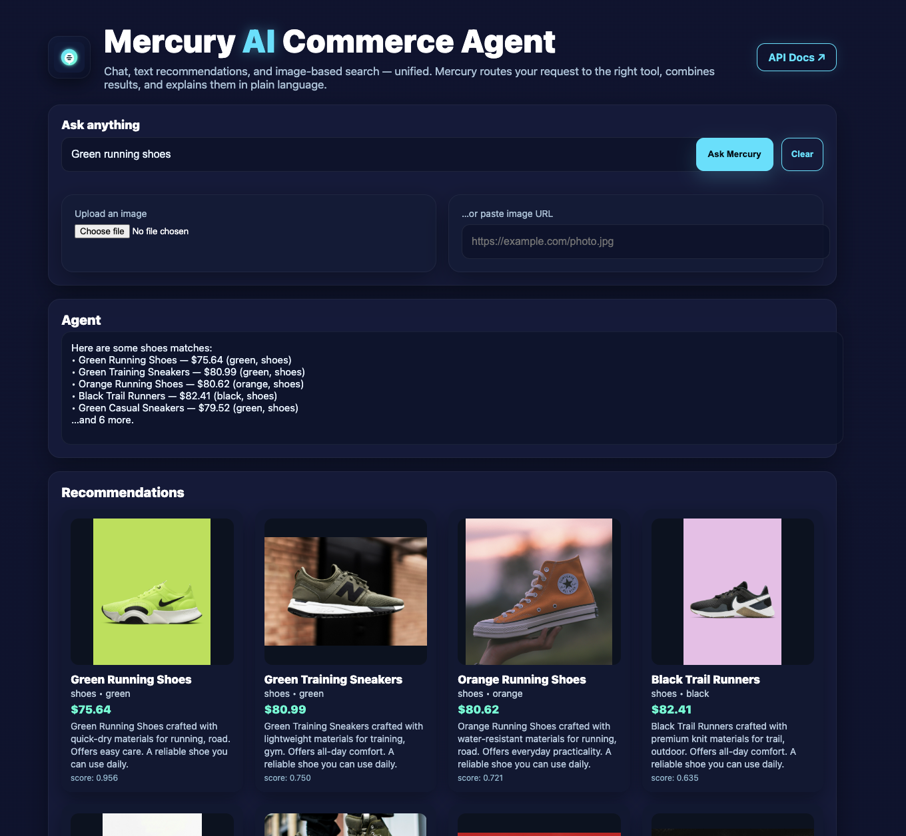

# Mercury — AI Agent for a Commerce Website
**One agent, three modes:** general chat · text recommendations · image-based product search  
Stack: **FastAPI** (backend) + **Vite React (TypeScript)** + **Tailwind**. Optional OpenAI chat.

---

## Requirements Coverage

- **User-friendly frontend interface** → Polished React UI (hero, badges, chat, image search, recommendations, catalog).
- **Documented agent API** → FastAPI Swagger at **`http://localhost:8000/docs`** plus `GET /health`.
- **Single agent handles all** → One backend app exposes **chat**, **text recs**, **image search** over one catalog.
- **Catalog-limited** → Both recommendation and visual search operate only over `backend/data/catalog.json`.
- **Tech choices explained** → See **Design**.
- **Optional LLM** → Runs offline; if `OPENAI_API_KEY` is set, chat auto‑upgrades.

---

## Quickstart

### Backend (FastAPI)
```bash
cd backend
python -m venv .venv && source .venv/bin/activate   # Windows: .venv\Scripts\activate
python -m pip install --upgrade pip
pip install -r requirements.txt
uvicorn app:app --reload --port 8000
# Docs → http://localhost:8000/docs
# Health → http://localhost:8000/health
```

Use OpenAI (optional):
```bash
export OPENAI_API_KEY=sk-...          # Windows PowerShell: $env:OPENAI_API_KEY="sk-..."
export OPENAI_MODEL=gpt-4o-mini
uvicorn app:app --reload --port 8000
```

Low‑disk mode (optional):
```bash
# Smaller image model to reduce downloads (you can skip image search entirely if space is very low)
export IMAGE_MODEL=RN50
export IMAGE_PRETRAINED=openai
uvicorn app:app --reload --port 8000
```

### Frontend (Vite + React + Tailwind)
```bash
cd frontend
cp .env.example .env                  # ensure VITE_API_BASE=http://localhost:8000
npm install
npm run dev                           # UI → http://localhost:5173
```

---

## Agent Behavior

- **Chat (`POST /api/chat`)**
  - With `OPENAI_API_KEY` → OpenAI chat.
  - Without it → local smalltalk plus **intent routing** to recommendations.

- **Text Recommendations (`POST /api/recommend`)**
  - Corpus = `title | brand | category | description | tags`.
  - Embeddings + BM25 hybrid; returns top‑k products.

- **Image Search (`POST /api/image-search`)**
  - CLIP encodes catalog and query image; returns nearest neighbors.
  - If you skip `IMAGE_MODEL` exports, the endpoint returns empty (graceful).

- **Catalog (`GET /api/catalog`)** → items used by both recommenders.

- **Health (`GET /health`)** → sanity + item count.

---

## API Examples

```bash
# Chat
curl -X POST http://localhost:8000/api/chat \
  -H "Content-Type: application/json" \
  -d '{"user_id":"demo","message":"What can you do?"}'

# Text recs
curl -X POST http://localhost:8000/api/recommend \
  -H "Content-Type: application/json" \
  -d '{"user_id":"demo","query":"lightweight sports tee under $30","top_k":8}'

# Image search
curl -X POST http://localhost:8000/api/image-search \
  -F "image_url=https://images.unsplash.com/photo-1516826957135-700dedea698c?q=80&w=800"

# Catalog
curl http://localhost:8000/api/catalog
```

---

## Design

- **Unified agent**: one FastAPI service orchestrates chat + text recs + visual search.
- **Embeddings-first**: strong zero‑shot baseline; easy to swap a vector DB later.
- **Graceful degradation**: offline by default; LLM / larger models are opt‑in.
- **Frontend UX**: dark neon theme; chat shows bullets and inline product cards.
- **Maintainability**: thin `services/*`, typed `schemas.py`, clear catalog boundary.

**Future extensions (deferred due to disk/time):**
- Larger CLIP (ViT‑B/32 or ViT‑L/14), pgvector/Qdrant, personalization, admin tools.

---

## Repo Layout

```
ai-commerce-agent-pro/
├── backend/
│   ├── app.py
│   ├── requirements.txt
│   ├── schemas.py
│   ├── data/
│   │   └── catalog.json
│   ├── scripts/
│   │   └── prewarm.py             # optional; can be run later
│   └── services/
│       ├── chat.py
│       ├── image_search.py
│       ├── recommender.py
│       └── utils.py
└── frontend/
    ├── .env.example
    ├── index.html
    ├── package.json
    ├── postcss.config.js
    ├── tailwind.config.js
    ├── tsconfig.json
    ├── vite.config.ts
    └── src/
        ├── App.tsx
        ├── index.css
        ├── main.tsx
        ├── lib/api.ts
        └── components/ProductCard.tsx
```

---

## Notes

- First run may download small model weights; if disk is tight, use `IMAGE_MODEL=RN50` or skip image search.
- Everything runs on CPU by default.
- For image search, paste a **direct** public image URL (ending in a real image path).

## Screenshots (Demo)





